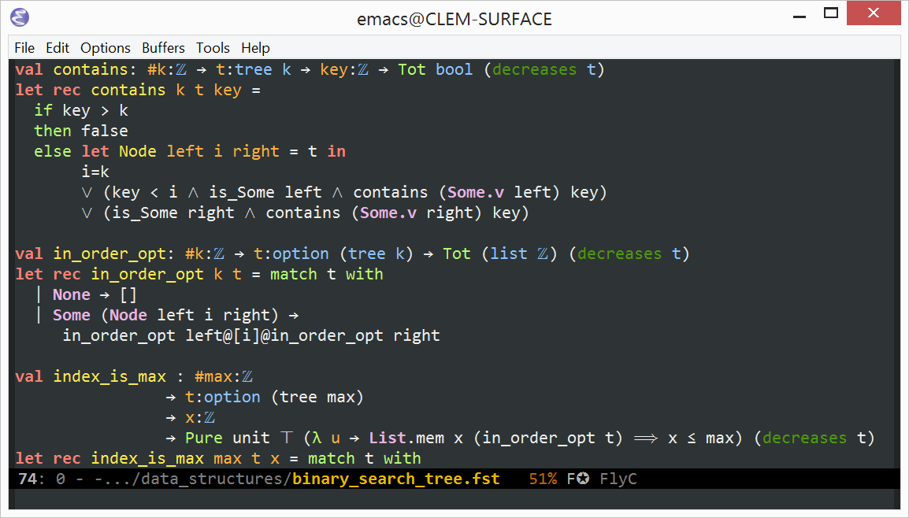

[](https://melpa.org/#/fstar-mode) [](https://travis-ci.org/FStarLang/fstar-mode.el)

## Use F* in Emacs!



## Setup

F*-mode requires Emacs 24.3 or newer, and is distributed through [MELPA](https://melpa.org).

1.  Add the following to your init file (usually `.emacs`) if it is not already there:

    ```elisp
    (require 'package)
    (add-to-list 'package-archives '("melpa" . "http://melpa.org/packages/") t)
    (package-initialize)
    ```

2.  Restart Emacs, then run <kbd>M-x package-refresh-contents</kbd> and <kbd>M-x package-install RET fstar-mode RET</kbd>. Future updates can be downloaded using <kbd>M-x list-packages U x y</kbd>.

3.  If `fstar.exe` and `z3` are not already in your path, set the `fstar-executable` and `z3-executable` variables:

    ```elisp
    (setq-default fstar-executable "PATH-TO-FSTAR.EXE")
    (setq-default fstar-smt-executable "PATH-TO-Z3(.EXE)")
    ```

`fstar-mode` is compatible with Tramp: if you open an F* file on a remote machine, `fstar-mode` run F* remotely [over SSH](#editing-remote-f*-files).

## Keybindings

:zap: indicates keybindings available once F* is running.<br/>
:sparkles: indicates features added since the latest F* release.<br/>
:unicorn: indicates features that require yet-unmerged patches to F*.<br/>

The common prefix for `fstar-mode` keybindings in `C-c C-s` (short for **s**tar).

### General

Key                         | Action
----------------------------|----------------------------------
`C-h .`                     | Show current error in echo area
`C-h M-w`                   | Copy current error message
`TAB` / `S-TAB`             | Indent / Unindent
`C-RET`                     | :zap: :sparkles: Autocomplete word at point
`C-c C-v` (**v**erify)      | :sparkles: Verify current file on the command line
`C-c C-s C-q` (**q**uit)    | Close temporary windows opened by `fstar-mode`

### Navigation

Key                                            | Action
-----------------------------------------------|----------------------------------
`M-n`, `M-p`                                   | Jump to previous/next block in current file
`M-.`, `C-x 4 .`, `C-x 5 .`                    | :zap: Jump to definition (same window, other window, other frame)
`C-c C-'`, `C-x 4 '`, `C-x 5 '`                | :zap: Browse to secondary location of current error (same window, other window, other frame)
`C-c C-a` (**a**lternate)                      | Switch to interface file (and back to implementation)
`C-c C-s C-o` (**o**utline)                    | Show an outline of the current buffer
`C-c C-s C-j C-d` (**j**ump to **d**ependency) | :zap: Jump to one of the dependencies of the current buffer
`M-,`                                          | Return to point before last jump

### Documentation, type hints, and computation

Key                                  | Action
-------------------------------------|----------------------------------
`<menu>`, `M-<f12>`                  | :zap: Show type and docs in a small inline window (repeat to hide the window)
`C-c C-s C-e` (**e**val)             | :zap: Evaluate (reduce) an expression (`C-u` to pick reduction rules)
`C-c C-s C-s` (**s**earch)           | :zap: Search F*'s global context for functions and theorems
`C-c C-s C-d` (**d**ocumentation)    | :zap: Show type and documentation of a symbol
`C-c C-s C-p` (**p**rint)            | :zap: Show type, documentation, and full definition of a symbol
`C-c C-s h o` (**h**elp **o**ptions) | :zap: Show values of F* options
`C-c C-s h w` (**h**elp **w**iki)    | Browse F\*'s wiki in Emacs
`C-c C-s h W` (**h**elp **W**iki)    | Browse F\*'s wiki in your browser

### Matching

Key                       | Action
--------------------------|----------------------------------
`C-c C-s C-c` (**c**ases) | :zap: :unicorn: Case split: insert a match, or refine match at point

### Interactive mode

Proof-General            | :atom: Atom   | Action
-------------------------|---------------|----------------------------------------------------------
`C-c C-n` (**n**ext)     | `C-S-n`       | :zap: Send the next paragraph to F* (with `C-u`, send it in lax mode)
`C-c C-p` (**p**revious) | `C-S-p`       | :zap: Retract the last paragraph
`C-c C-.`                | `C-S-.`       | :zap: Jump to beginning of untracked section
`C-c RET` or `C-c C-RET` | `C-S-i`       | :zap: Send everything up to the current point to F*
`C-c C-l` (**l**ax)      | `C-S-l`       | :zap: Send everything up to the current point to F*, in lax mode
`C-c C-b` (**b**uffer)   | `C-S-b`       | :zap: Send entire buffer to F* in lax mode
`C-c C-r` (**r**eload)   | `C-S-r`       | :zap: Reload dependencies of the current buffer and reprocess its contents (add `C-u` for lax mode)
`C-c C-x` (e**x**it)     | `C-M-c`       | :zap: Kill the F* subprocess
`C-c C-c`                | `C-M-S-c`     | :zap: Send an interrupt signal to Z3.  This (generally) interrupts the currently running verification task.

Use <kbd>M-x customize-variable RET fstar-interactive-keybinding-style RET</kbd> to pick a keybinding style. The default is Proof-General; the other option is Atom. Please be aware of the [current restrictions](https://github.com/FStarLang/FStar/wiki/Dealing-with-F%E2%98%85-dependencies#when-invoking-f-in-interactive-mode) on the interactive-mode.

### Completion

These keybindings are available during completion only:

Key     | Action
--------|------------------------------------------------
`C-h`   | Show documentation of current completion candidate
`C-w`   | Show definition of current completion candidate
`C-s`   | Search among completion candidates

## Advanced topics and customization

### Enabling and disabling individual F* mode components

Use <kbd>M-x customize-variable RET fstar-enabled-modules RET</kbd> to choose which parts of `fstar-mode` to enable.

### Title comments

F*-mode recognizes and highlights certain special comments as titles: `(***` and `(** *`; `(*+`, `(**+`, and `(** **`; and `(*!`, `(**!`, and `(** ***`.

### Using F*-mode for F# files

Use the following snippet:

```elisp
(add-to-list 'auto-mode-alist '("\\.fsi?\\'" . fstar-mode))
```

### Including external libraries and passing custom flags to F*

Add the following line to your `.emacs`:

```elisp
(setq fstar-subp-prover-args '("--include" "<your-path>"))
```

Use `C-h v fstar-subp-prover-args` for more details.  If your project requires a set of flags to be passed to `fstar`, it's OK to use a `.dir-locals.el` to set `fstar-subp-prover-args`.  In that case, users can add further arguments using `fstar-subp-prover-additional-args`.

### Editing remote F* files

F*-mode is compatible with Emacs' Tramp.  To use F*-mode over tramp:

* Set `fstar-executable` and `z3-executable` appropriately (if F* and Z3 are in your path on the remote machine it's enough to use `fstar.exe` and `z3`; otherwise, use their full paths on the remote machine — e.g. `~/FStar/bin/fstar.exe`),
* Open a remote file (`C-x C-f /sshx:username@remote-server: RET test.fst RET`).  Processing this file should invoke a remote F* through SSH.

### Hiding parts of a buffer

Use `M-x fstar-selective-display-mode` to toggle selective display.  In selective display mode, consecutive lines prefixed with `(**)` are collapsed into a single `👻`.

### Programming with tactics

`fstar-mode` opens a `*goals*` window as soon as an F* tactic prints out a goal.  Use `<prior>` and `<next>` (“page up” and “page down”) to navigate that window.

### Completion

F*-mode's completion uses `company-mode` under the hood.  Try `M-x customize-group company`.

### Real-time verification

Customize the variable `fstar-flycheck-checker` to pick your favorite style of real-time verification (full-buffer verification or lightweight typechecking).  F*-mode's real-time checking uses `flycheck-mode` under the hood: try `M-x customize-group flycheck` to tweak Flycheck further.

## Troubleshooting

### Performance issues

If Emacs gets very sluggish when you open an F* file, try turning off prettification with `M-x prettify-symbols-mode`.  If that works, you're seeing Emacs bug 21022.  Emacs 26 will include a fix; in Emacs 25, you should be able to work around it by following the font configuration instructions below.

### Missing characters

Boxes instead of math symbols are most likely due to missing fonts. DejaVu Sans Mono, [Symbola](http://shapecatcher.com/downloads/Symbola706.zip), FreeMono, STIX, Unifont, Segoe UI Symbol, Arial Unicode and Cambria Math are all good candidates. If Emacs doesn't automatically use the new fonts after a restart, the following snippet (add it to your `.emacs`) should help (change `Symbola` and `DejaVu sans Mono` to the Unicode font you just downloaded and to your usual monospace font, respectively):

```elisp
(set-fontset-font t 'unicode (font-spec :name "Symbola") nil 'prepend)
(set-fontset-font t 'greek (font-spec :name "DejaVu sans Mono") nil 'prepend)
```

For Emacs < 25, you'll need the following instead:

```elisp
(set-fontset-font t 'unicode (font-spec :name "YOUR USUAL EMACS FONT") nil)
(set-fontset-font t 'unicode (font-spec :name "SOME FONT WITH GOOD COVERAGE AS LISTED ABOVE") nil 'append)
```

### Fonts for specific characters

Use the following snippet to use `XITS Math` for `∀`:

```elisp
(set-fontset-font t (cons ?∀ ?∀) "XITS Math" nil 'prepend)
```

### Cygwin

If you're using Emacs on Windows with Cygwin (😱), you can install [windows-path.el](https://www.emacswiki.org/emacs/windows-path.el)

The short version is to do:

```
$ wget https://www.emacswiki.org/emacs/download/windows-path.el
```

Then, in your .emacs
```elisp
(require 'windows-path "<path to windows-path.el>")
(windows-path-activate)
```

### Building from source

Setup MELPA as described above, then install the dependencies and clone the repo to a directory of your choice (`~/.emacs.d/lisp/fstar-mode.el` for example). Optionally byte-compile `fstar-mode.el`, and finally add the following to your init file:

```elisp
(require 'fstar-mode "~/.emacs.d/lisp/fstar-mode.el/fstar-mode.el")
```

### Complaints about version numbers

When running an F#-compiled F* `fstar-mode` will complain about being unable to parse F*'s version number and assume you're running a relatively old F* (it needs to know F*'s version number to decide which features to enable).  You can override this check by customizing `fstar-assumed-vernum`.
